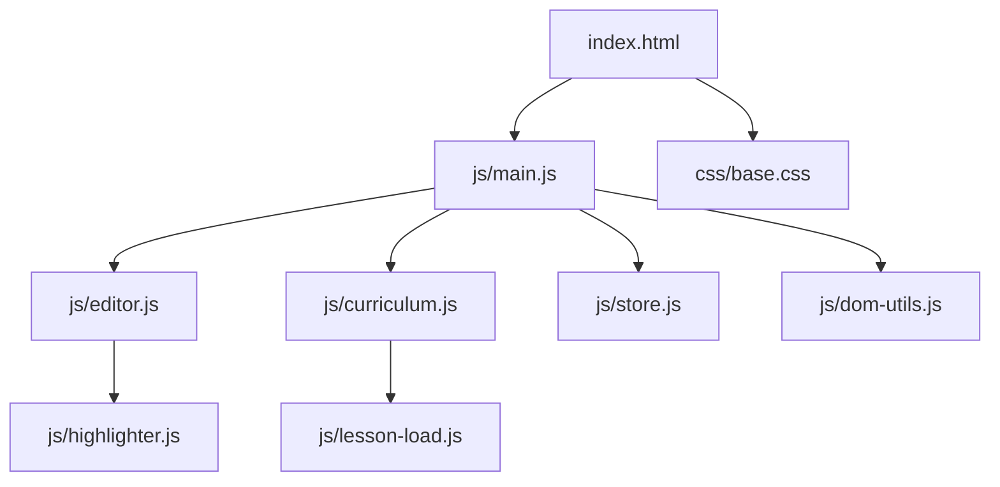

# Architecture

DevForge is a zero-dependency web-based code editor and interactive curriculum for learning web development. It is built purely with HTML, CSS, and JavaScript, without any bundlers or external libraries on the frontend.

## System Components

## Data Flow

- **Editor State**: The user types in the editor (`js/editor.js`), which triggers updates and highlighting (`js/highlighter.js`).
- **Store**: Application state is managed via `js/store.js` and `js/state.js`.
- **Lessons**: Curriculum data is loaded through `js/curriculum.js` and displayed via `js/lesson-load.js`.

