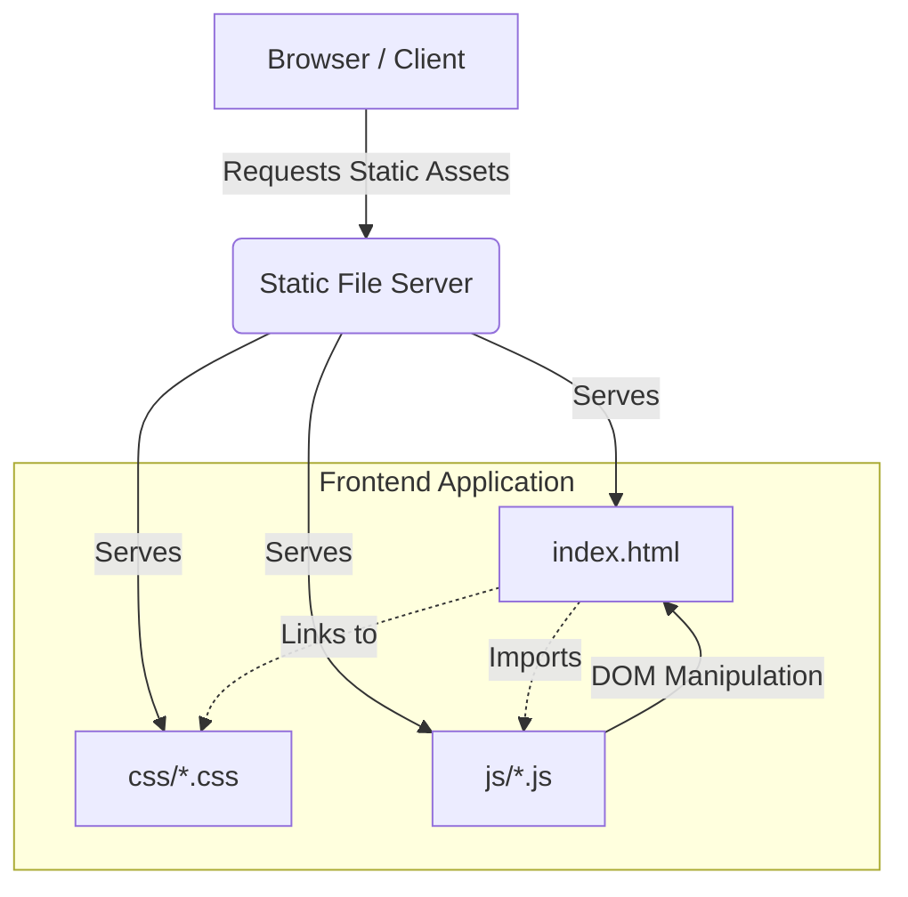
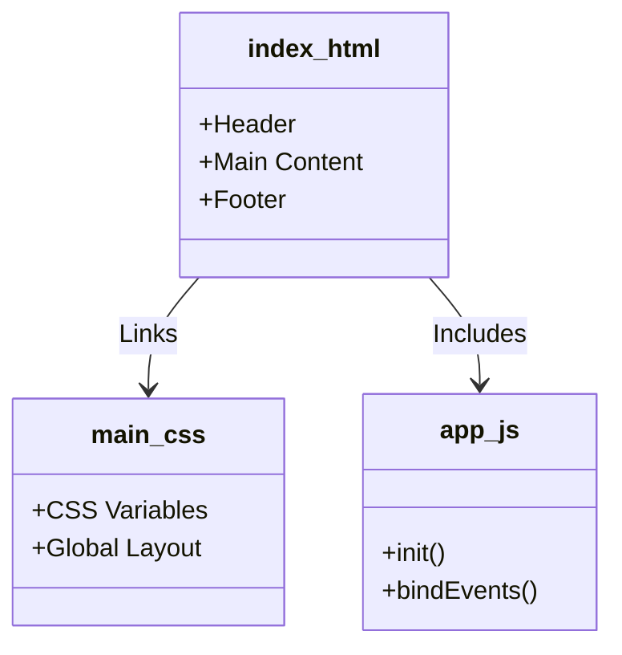
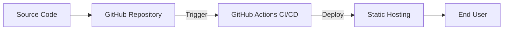

# DevForge Architecture

DevForge is a lightweight static web application designed to be simple, fast, and easy to host. It primarily consists of HTML, CSS, and Vanilla JavaScript, with no complex backend frameworks required to serve the frontend.

## 🏗 High-Level Overview

The architecture is entirely client-side. The structure is separated into concerns:

1. **Presentation Layer**: `index.html` serves as the entry point and structural skeleton.
2. **Styling Layer**: The `css/` directory contains stylesheets to handle layout, typography, and responsive design.
3. **Logic Layer**: The `js/` directory holds modular Vanilla JavaScript files that manage DOM manipulation, user interactions, and logic.

### 📊 Architecture Diagram

## 📂 Directory Structure

- **`index.html`**: Main application view.
- **`css/`**: Global and component-specific stylesheets.
- **`js/`**: Frontend JavaScript logic.
- **`tests/`**: Unit tests running via Vitest.
- **`tests-e2e/`**: End-to-end tests running via Playwright.

### 🧩 Component Relationship

## 🧪 Testing Strategy

DevForge emphasizes test-driven development:

- **Unit Testing**: Powered by [Vitest](https://vitest.dev/), focusing on JavaScript logic and utility functions.
- **E2E Testing**: Powered by [Playwright](https://playwright.dev/), ensuring that user flows function correctly in a real browser environment.

## 🚀 Deployment

Because DevForge is a static site, it can be deployed to any static hosting provider (e.g., GitHub Pages, Vercel, Netlify) by simply serving the root directory.

